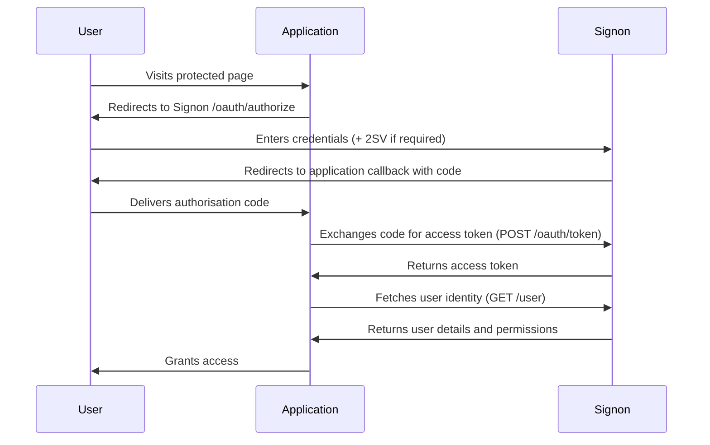
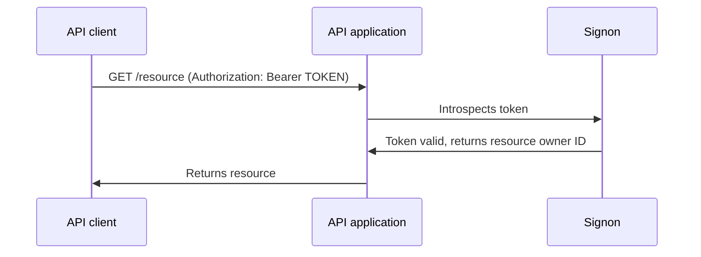

Signon is the centralised OAuth2-based single sign-on service for GOV.UK publishing. It manages user identities, application registrations, and permissions across the GOV.UK publishing platform, so each application does not need to implement its own authentication.

## What Signon does

When a user visits a GOV.UK publishing application, the application redirects them to Signon to authenticate. Signon verifies their credentials (including two-step verification where required), then redirects them back to the application with an OAuth2 authorisation code. The application exchanges that code for an access token and retrieves the user's identity and permissions.

Applications never handle passwords directly. All credential management, account recovery, and session control stays in Signon.

## Key components

Signon is a Ruby on Rails application. Its core functionality is provided by three libraries:

- **[Devise](https://github.com/plataformatec/devise)** — handles user authentication: sign-in, password management, invitations, confirmations, and two-step verification.
- **[Doorkeeper](https://github.com/applicake/doorkeeper)** — provides the OAuth2 server: authorisation endpoint, token endpoint, and token introspection.
- **[Pundit](https://github.com/varvet/pundit)** — enforces authorisation policies that determine what each role can see and do within Signon's admin interface.

## User roles

Signon has five roles with increasing levels of access:

| Role | Description |
|---|---|
| **User** | Can sign in to applications they have been granted access to. |
| **Organisation admin** | Can manage users within their own organisation. |
| **Super organisation admin** | Can manage users across an organisation and its child organisations. |
| **Admin** | Can manage all users, applications, and permissions. |
| **Superadmin** | Full access, including application registration and API user management. |

<Note>
Most day-to-day user management is done by Organisation admins. Superadmin access is required to register new applications or create API users.
</Note>

## How applications integrate

Applications integrate with Signon using the [gds-sso](https://github.com/alphagov/gds-sso) gem. The gem handles the OAuth2 Authorization Code flow and makes the authenticated user available to the application as `current_user`.

To integrate an application:

1. Register it in Signon to receive a client ID and secret.
2. Set `OAUTH_ID` and `OAUTH_SECRET` in the application's environment.
3. Configure `gds-sso` in the application's initializer.
4. Grant users the `signin` permission for the application in Signon.

## Authentication flows

Signon supports two authentication patterns:

### Authorization Code flow (end-user sign-in)

Used when a human user signs in through a browser.

### Bearer token flow (API access)

Used when one application needs to make authenticated API calls to another.

An API user is created in Signon, a Bearer token is generated for a specific application, and that token is passed as an `Authorization` header on each request. The receiving application calls `doorkeeper_authorize!` to validate the token.

<Tip>
For service-to-service calls, use API users and Bearer tokens. Reserve the Authorization Code flow for applications accessed by human users.
</Tip>

## Next steps

<CardGroup cols={2}>
  <Card title="Quick start" icon="rocket" href="/quickstart">
    Register your application and get your first users authenticated.
  </Card>
  <Card title="Environment variables" icon="sliders" href="/environment-variables">
    Reference for all environment variables required to run Signon.
  </Card>
</CardGroup>
